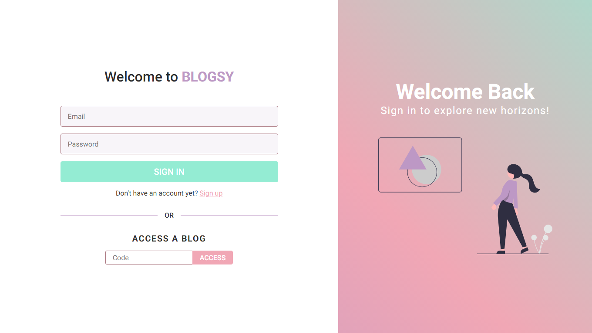
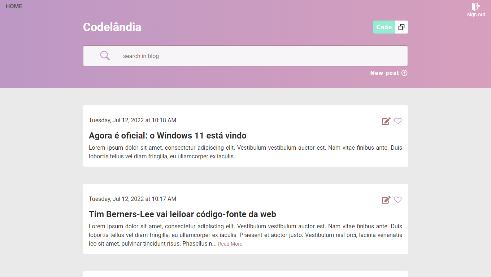

# Blogsy

## 💻 Project
A simple blog application that lets you create your own blog and share it with your friends.

You can check out a fully working version of this project [here](https://blog-sy.vercel.app/)

## 🧪 Technologies
This project was built with the following technologies:
- [React](https://reactjs.org)
- [TypeScript](https://www.typescriptlang.org/)
- [Node](https://nodejs.org/en/)

## 📝 License
This project is licensed under the terms of the MIT license. See [LICENSE](LICENSE) for more details.
